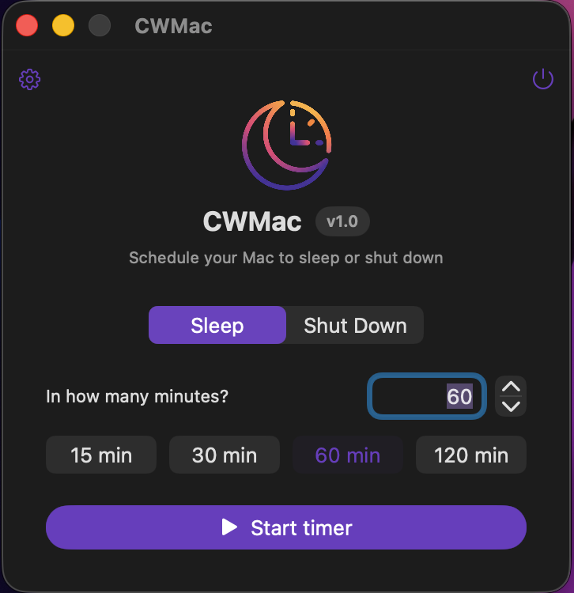

# CWMac

A tiny macOS menu bar utility that puts your Mac to **sleep** or **shuts it down** after a timer you set. Bilingual (English / Polski).

*Mały program dla macOS, który po ustawionym czasie **usypia** albo **wyłącza** Maca. Interfejs po angielsku i po polsku.*

   
  

## Download / Pobierz

**[⬇️ Download the latest version](https://github.com/mikagosz/CWMac/releases/latest)** — no coding needed. *Pobierz najnowszą wersję — bez kodowania.*

1. Download `CWMac.zip` from the latest release and unzip it. / Pobierz `CWMac.zip` i rozpakuj.
2. Move **CWMac.app** to your **Applications** folder. / Przenieś **CWMac.app** do folderu **Programy**.
3. The app isn't notarized yet, so on first launch **right-click** (Control-click) the app → **Open** → **Open**.

> Aplikacja nie jest jeszcze notaryzowana, więc przy pierwszym uruchomieniu kliknij ją **prawym przyciskiem → Otwórz → Otwórz** (lub: Ustawienia systemowe → Prywatność i bezpieczeństwo → *Otwórz mimo to*).

---

## Features / Funkcje

- ⏱️ Countdown timer with quick presets (15 / 30 / 60 / 120 min) or a custom value.
- 💤 Choose the action: **Sleep** or **Shut Down**.
- 🔔 Warning notification before the action (5 min before, or 1 min for short timers).
- 🧭 Menu bar item showing the remaining **minutes** and a `zzz` symbol while counting down.
- 🎨 Menu bar icon in **color** or **monochrome** (your choice in Settings).
- 🖱️ **Double-click** the menu bar icon to open the window; single / right click opens a menu.
- 🫥 Closing the window keeps the app running in the menu bar (and hides it from the Dock while a timer is active).
- 🌍 Language switch in Settings: **System / English / Polski** (changes live, no restart).

## Requirements / Wymagania

- macOS 26.5 or later
- Xcode 26 or later (to build from source)

## Build & Run / Budowanie i uruchomienie

1. Open `CWMac.xcodeproj` in Xcode.
2. Select the **CWMac** scheme.
3. Press **Run** (⌘R).

> **Note / Uwaga:** The app runs **without the App Sandbox** on purpose — it needs to
> run `pmset sleepnow` (sleep) and send a shutdown command to *System Events*. The first
> time you use **Shut Down**, macOS asks for permission to control *System Events*; allow it.

## How to use / Jak używać

1. Launch the app — the main window appears.
2. Pick **Sleep** or **Shut Down**.
3. Set the number of minutes (type it, use the arrows, or tap a preset).
4. Click **Start timer**.
5. The menu bar shows the remaining minutes. You can close the window; the timer keeps running.
6. To stop early, click **Cancel** in the window, or **Cancel timer** in the menu bar menu.
7. Quit the app entirely with the power button in the window corner, or **Quit CWMac** in the menu.

## Project structure / Struktura projektu

| File | Purpose |
| --- | --- |
| `CWMacApp.swift` | App entry point, scenes, `AppDelegate` (keeps app alive, creates the status item). |
| `ContentView.swift` | Main window UI (setup + countdown views). |
| `CountdownManager.swift` | Timer logic (async/await) and running the sleep/shutdown commands. |
| `PowerAction.swift` | The sleep / shutdown action type. |
| `StatusItemController.swift` | Menu bar icon (AppKit `NSStatusItem`), click handling, menu. |
| `SettingsView.swift` | Settings window (icon visibility/style, language). |
| `Localization.swift` | Lightweight PL/EN translation system. |
| `Theme.swift` | App accent color. |

Built with SwiftUI + AppKit, using the Observation framework (`@Observable`) and Swift concurrency.

## License / Licencja

Released under the [MIT License](LICENSE).
